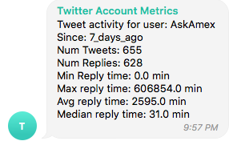
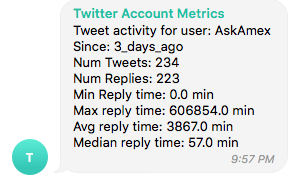
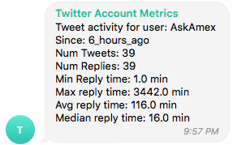

# Twitter Account Metrics Bot

An app to get metrics from Twitter accounts and report them to Telegram via a bot.

## Requirements

- Docker
- Go to <a href="https://developer.twitter.com/">https://developer.twitter.com/</a> and create an App.  Note your Consumer API Key and Secret Key.

## Screenshots

  

## Setup

- Clone this repo to your machine
- Run `./bin/run-0-get-credentials.sh` to configure your app.  You'll need to type in those two API values, the username you want to monitor, and then you'll be given a URL to connect to Twitter and get a PIN.
- Optional: Have an AWS account, copy `aws-credentials.txt.example` to `aws-credentials.txt` and fill in the credentials.  This will allow database backups to be made
- Copy `docker-compose.yml.example` to `docker-compose.yml` and enter in your Telegram Token and Chat ID.
- Run `./bin/run-1-fetch-tweets.sh --num 5000` to fetch as many tweets as possible.  This will prime the database, as future runs involve 
- Now run `docker-compose up -d` and tweets will start being downloaded with stats being written to the Telegram Channel of your user.  This is useful for monitoring activity on organization social media accounts.

## Exporting Saved Tweets

The command ` ./bin/run-1-export-to-json.sh` will dump all tweets to `tweets.json`.

## Development

- To work on a script interactively, there are dev scripts which will spawn a shell in Docker with the script to be found in `/mnt/bin/`:
   - `./bin/dev-0-get-credentials.sh`
   - `./bin/dev-1-fetch-tweets.sh`
   - `./bin/dev-2-telegram-bot.sh`
   - `./bin/dev-2-backup.sh`
- To set environment variables for testing the Telegram bot, copy `bin/`dev-set-telegram-env.sh.EXAMPLE` to `bin/dev-set-telegram-env.sh`, edit the variables, and run `. dev-set-telegram-env.sh` to set them in your shell.
- To view your backup directory: `./bin/aws/get-s3-dir`
- To download the latest backup: `./bin/aws/download-latest-backup`

# FAQ

## How do I get Telegram Group/Chat IDs?

From <a href="https://stackoverflow.com/a/45577773/196073">https://stackoverflow.com/a/45577773/196073</a>:
- Go to your group in <a href="https://web.telegram.org/">the web interface</a> and grab the link. e.g. https://web.telegram.org/#/im?p=g154513121
- Copy That number after g and put a (-) Before That. e.g. -154513121
- Send Your Message to group. e.g. `bot.send_message(-154513121, "Hi")`

# Credits

- <a href="https://twython.readthedocs.io/en/latest/">Twython</a> - The Twitter client for Python, this made using Twitter's API a breeze.
- <a href="https://www.sqlite.org/index.html">SQLite</a> - Used for data storage.
- <a href="https://www.sqlalchemy.org/">SQLAlchemy</a> - This is my first project with SQLAlchemy, and it made tasks such as database schema maintenance and interacting with the database way easier to do!
- <a href="https://github.com/python-telegram-bot/python-telegram-bot">python-telegram-bot</a> - I use this module for connecting to Telegram, and it too makes my life much easier.
- Icons made by <a href="https://www.freepik.com/" title="Freepik">Freepik</a> from <a href="https://www.flaticon.com/" title="Flaticon">www.flaticon.com</a> is licensed by <a href="http://creativecommons.org/licenses/by/3.0/"  title="Creative Commons BY 3.0" target="_blank">CC 3.0 BY</a>

# Author

Myself, Douglas Muth.  Ways you can get in touch with me:
- <a href="http://www.dmuth.org/">My website</a>
- <a href="http://twitter.com/dmuth">Twitter</a>
- <a href="http://facebook.com/dmuth">Facebook</a>
- ...or just file a bug on this repo!

